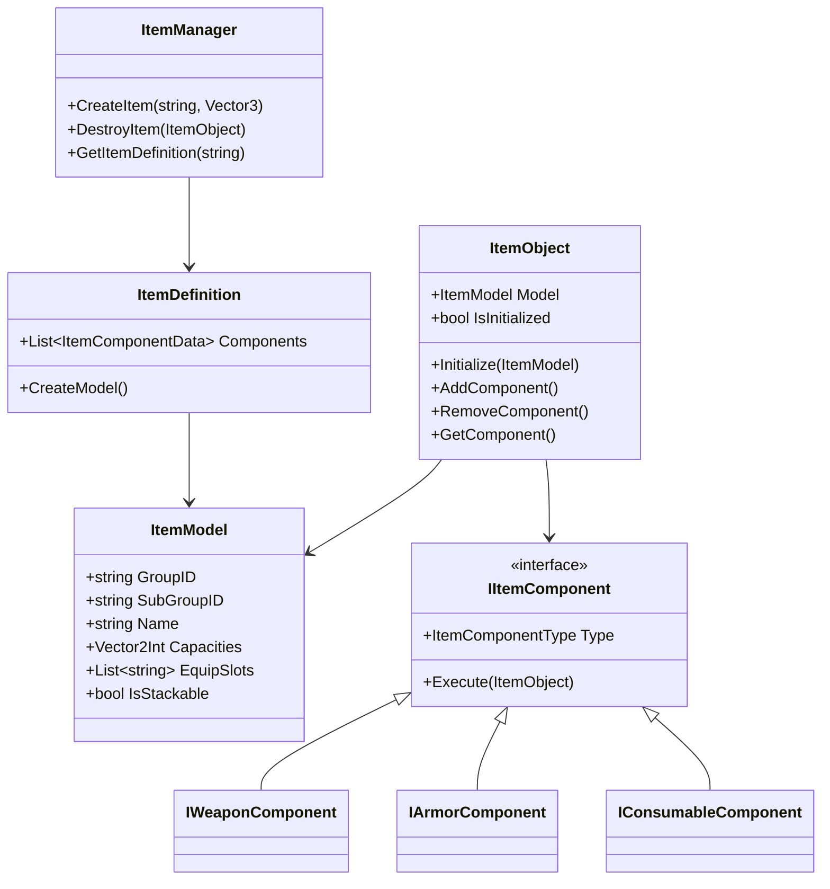

# [0.1.0] 2025-01-02 01:15:25

## Overview
Implemented the core item system with a component-based architecture, providing a foundation for equipment, inventory, and item interactions.

## New Features
### Item System Core Implementation
- Created a flexible component-based item system
- Key classes and interfaces:
  - `ItemModel`: Core data structure for items
  - `ItemObject`: Runtime representation of items
  - `IItemComponent`: Base interface for all item components
  - `ItemDefinition`: ScriptableObject for item definitions
  - `ItemManager`: Singleton for item management
- Specialized components:
  - Weapon system with damage and attack mechanics
  - Armor system with damage reduction and movement effects
  - Consumable system with effects and duration

## Adjustments and Refactoring
- Organized code into a clear folder structure:
  - `/Core/Items/Components/`: Component implementations
  - `/Core/Items/Interfaces/`: Component interfaces
  - `/Core/Items/Models/`: Data models
  - `/Core/Items/Data/`: ScriptableObject definitions
- Changed item capacities from List<string> to Vector2Int for grid-based inventory
- Implemented builder pattern for ItemModel construction
- Added validation for item definitions in Unity Inspector
