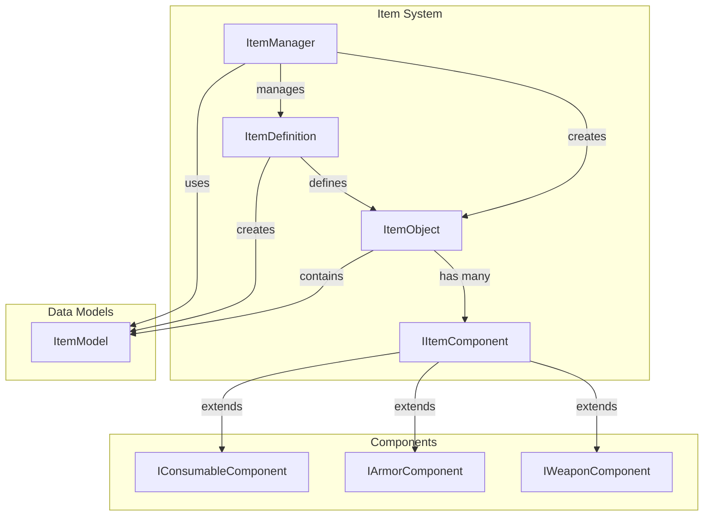
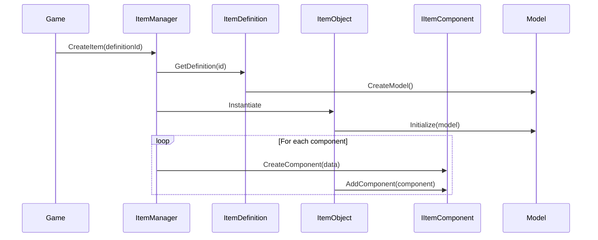
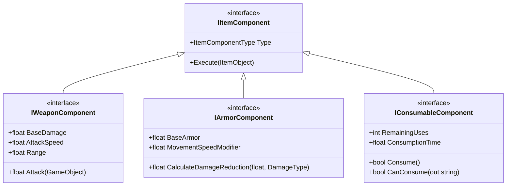
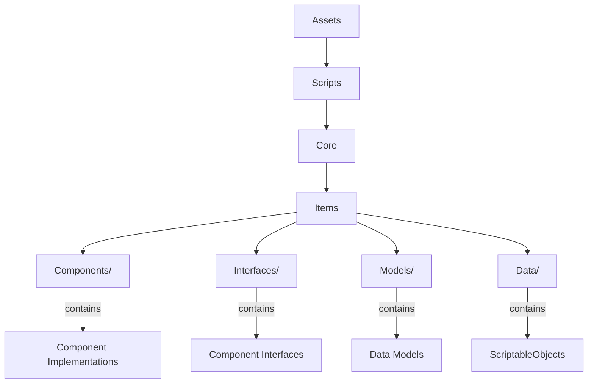

# Game Architecture

## Item System

### Core Components

```mermaid
graph TB
    subgraph Item System
        IM[ItemManager]
        ID[ItemDefinition]
        IO[ItemObject]
        IC[IItemComponent]
        
        IM -->|creates| IO
        IM -->|manages| ID
        ID -->|defines| IO
        IO -->|has many| IC
    end

    subgraph Components
        IC -->|extends| WC[IWeaponComponent]
        IC -->|extends| AC[IArmorComponent]
        IC -->|extends| CC[IConsumableComponent]
    end

    subgraph Data Models
        IM -->|uses| Model[ItemModel]
        ID -->|creates| Model
        IO -->|contains| Model
    end
```

### Data Flow

```mermaid
sequenceDiagram
    participant Game
    participant IM as ItemManager
    participant ID as ItemDefinition
    participant IO as ItemObject
    participant IC as IItemComponent

    Game->>IM: CreateItem(definitionId)
    IM->>ID: GetDefinition(id)
    ID->>Model: CreateModel()
    IM->>IO: Instantiate
    IO->>Model: Initialize(model)
    loop For each component
        IM->>IC: CreateComponent(data)
        IO->>IC: AddComponent(component)
    end
```

### Component Hierarchy

```mermaid
classDiagram
    class IItemComponent {
        <<interface>>
        +ItemComponentType Type
        +Execute(ItemObject)
    }

    class IWeaponComponent {
        <<interface>>
        +float BaseDamage
        +float AttackSpeed
        +float Range
        +float Attack(GameObject)
    }

    class IArmorComponent {
        <<interface>>
        +float BaseArmor
        +float MovementSpeedModifier
        +float CalculateDamageReduction(float, DamageType)
    }

    class IConsumableComponent {
        <<interface>>
        +int RemainingUses
        +float ConsumptionTime
        +bool Consume()
        +bool CanConsume(out string)
    }

    IItemComponent <|-- IWeaponComponent
    IItemComponent <|-- IArmorComponent
    IItemComponent <|-- IConsumableComponent
```

### Folder Structure

```mermaid
graph TD
    Root[Assets] --> Scripts
    Scripts --> Core
    Core --> Items

    Items --> Components[Components/]
    Items --> Interfaces[Interfaces/]
    Items --> Models[Models/]
    Items --> Data[Data/]

    Components -->|contains| CC[Component Implementations]
    Interfaces -->|contains| IC[Component Interfaces]
    Models -->|contains| MC[Data Models]
    Data -->|contains| DC[ScriptableObjects]
```
