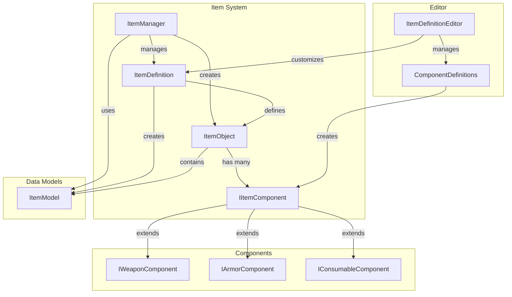
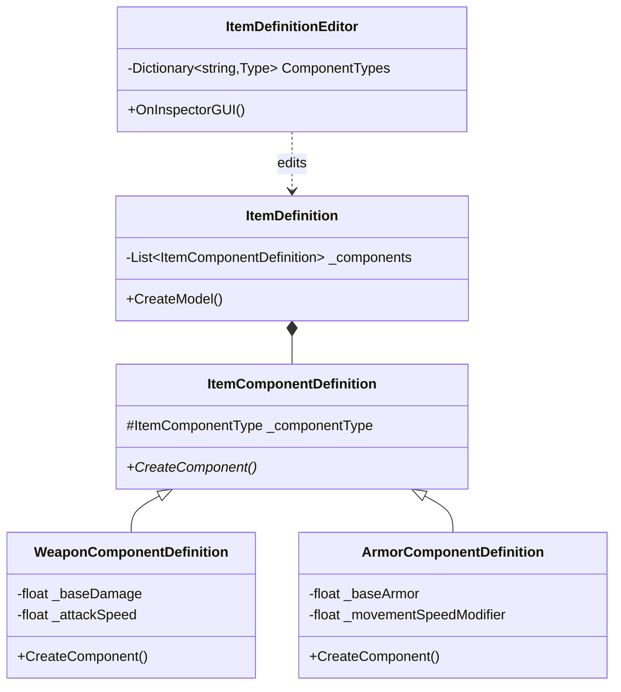
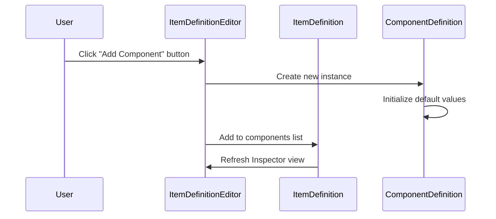
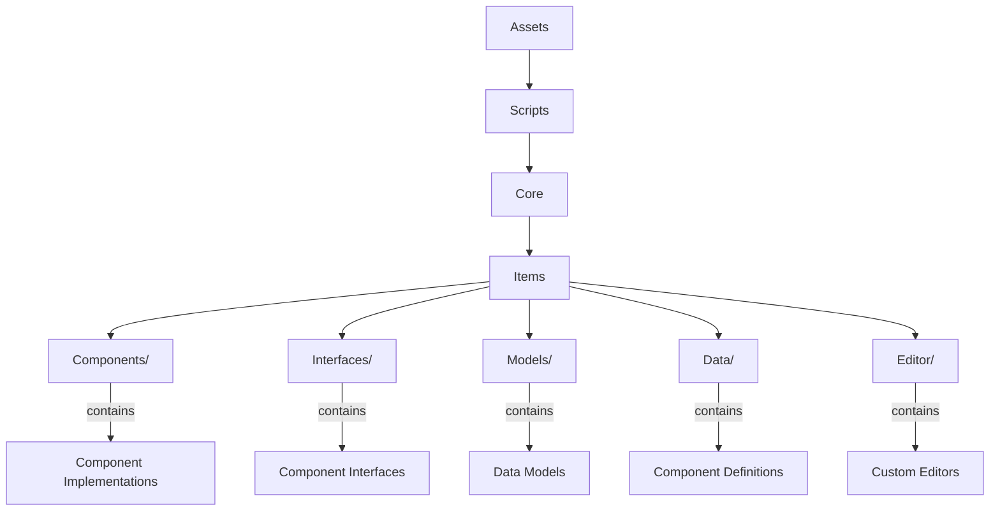

# Game Architecture

## Item System

### Core Components

```mermaid
graph TB
    subgraph Item System
        IM[ItemManager]
        ID[ItemDefinition]
        IO[ItemObject]
        IC[IItemComponent]
        
        IM -->|creates| IO
        IM -->|manages| ID
        ID -->|defines| IO
        IO -->|has many| IC
    end

    subgraph Components
        IC -->|extends| WC[IWeaponComponent]
        IC -->|extends| AC[IArmorComponent]
        IC -->|extends| CC[IConsumableComponent]
    end

    subgraph Data Models
        IM -->|uses| Model[ItemModel]
        ID -->|creates| Model
        IO -->|contains| Model
    end

    subgraph Editor
        IDE[ItemDefinitionEditor]
        IDE -->|customizes| ID
        IDE -->|manages| CD[ComponentDefinitions]
        CD -->|creates| IC
    end
```

### Component System

```mermaid
classDiagram
    class ItemDefinition {
        -List~ItemComponentDefinition~ _components
        +CreateModel()
    }

    class ItemComponentDefinition {
        #ItemComponentType _componentType
        +CreateComponent()*
    }

    class WeaponComponentDefinition {
        -float _baseDamage
        -float _attackSpeed
        +CreateComponent()
    }

    class ArmorComponentDefinition {
        -float _baseArmor
        -float _movementSpeedModifier
        +CreateComponent()
    }

    class ItemDefinitionEditor {
        -Dictionary~string,Type~ ComponentTypes
        +OnInspectorGUI()
    }

    ItemDefinition *-- ItemComponentDefinition
    ItemComponentDefinition <|-- WeaponComponentDefinition
    ItemComponentDefinition <|-- ArmorComponentDefinition
    ItemDefinitionEditor ..> ItemDefinition : edits
```

### Editor Workflow

```mermaid
sequenceDiagram
    participant User
    participant Editor as ItemDefinitionEditor
    participant Definition as ItemDefinition
    participant Component as ComponentDefinition

    User->>Editor: Click "Add Component" button
    Editor->>Component: Create new instance
    Component->>Component: Initialize default values
    Editor->>Definition: Add to components list
    Definition->>Editor: Refresh Inspector view
```

### Folder Structure

```mermaid
graph TD
    Root[Assets] --> Scripts
    Scripts --> Core
    Core --> Items

    Items --> Components[Components/]
    Items --> Interfaces[Interfaces/]
    Items --> Models[Models/]
    Items --> Data[Data/]
    Items --> Editor[Editor/]

    Components -->|contains| CC[Component Implementations]
    Interfaces -->|contains| IC[Component Interfaces]
    Models -->|contains| MC[Data Models]
    Data -->|contains| DC[Component Definitions]
    Editor -->|contains| EC[Custom Editors]
```
